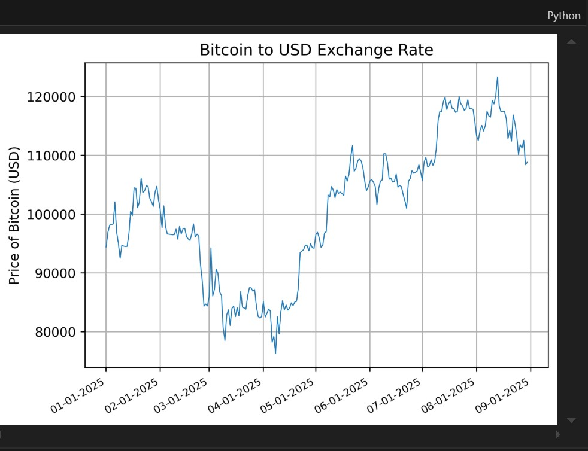
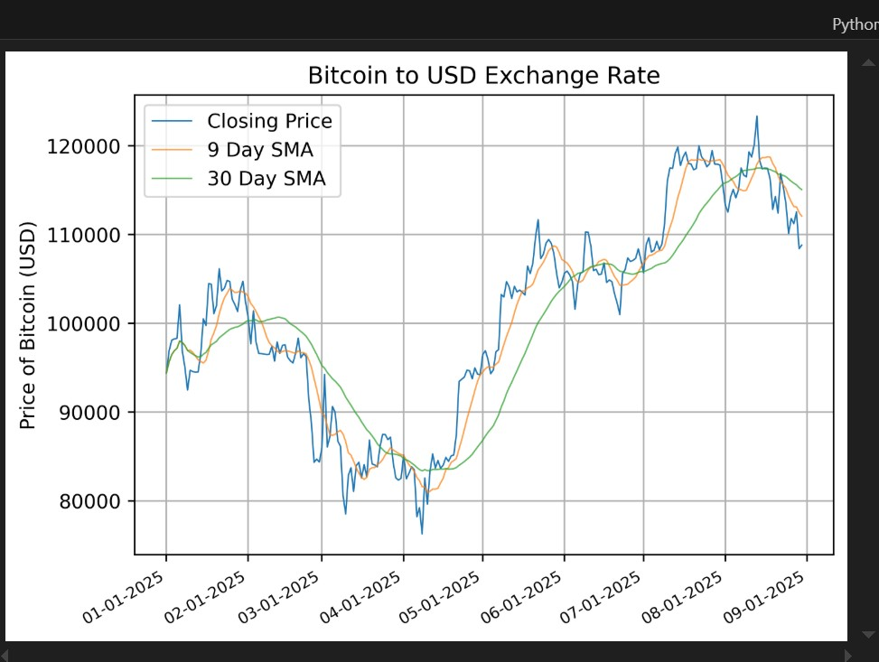
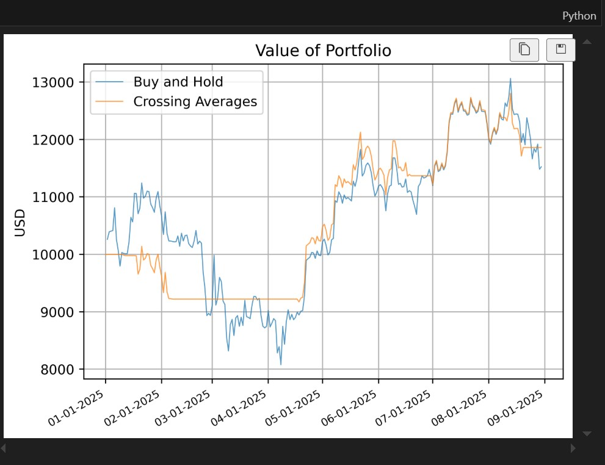

# Crossover SMAs Crypto Trading Algorithm

This project demonstrates a simple **Moving Average Crossover Strategy** using Python.  
It uses historical Bitcoin data, calculates two Simple Moving Averages (SMAs), generates trading signals based on crossovers, and compares the performance of the strategy to a simple Buy-and-Hold approach.

The purpose of this project is to showcase data analysis and basic algorithmic trading logic using **Python**, **Pandas**, **Matplotlib**, and **yfinance**.

---

## Features

- Fetch historical Bitcoin price data using [yfinance](https://pypi.org/project/yfinance/)  
- Calculate and visualize 9-day and 30-day Simple Moving Averages  
- Generate Buy/Sell signals based on SMA crossovers  
- Backtest the strategy against a Buy & Hold benchmark  
- Display results with professional charts

---

## Project Structure

```
Crossover-SMAs-Crypto-Trading-Algorithm/
│
├── main.py # Entry point of the project
├── README.md # Project documentation
├── requirements.txt # Python dependencies
└── src/
├── data_loader.py # Downloading market data
├── analysis.py # SMA calculations & signals
├── visualization.py # Plotting and charts
└── backtest.py # Backtesting logic

```

## Installation & Setup
```
### 1. Clone the repository

git clone https://github.com/<PatienceKeter>/Crossover-SMAs-Crypto-Trading-Algorithm.git
cd Crossover-SMAs-Crypto-Trading-Algorithm

### 2. Create a virtual environment

python -m venv venv
source venv/Scripts/activate    # on Windows: venv\Scripts\activate

### 3. Install dependancies
pip install -r requirements.txt

### 4. Run the project
python main.py
```

## Sample Output

Below are some sample charts generated by the algorithm:

### Bitcoin Price Chart


### Moving Averages


### Trade Signals


### Backtest Results



## Notes

This project is for educational and demonstration purposes only.
It does not constitute financial advice.
The algorithm is intentionally simple to illustrate Python data analysis skills.